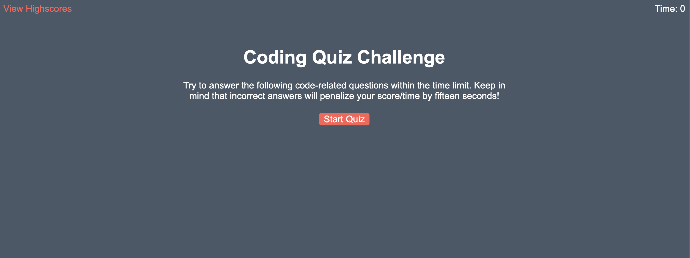
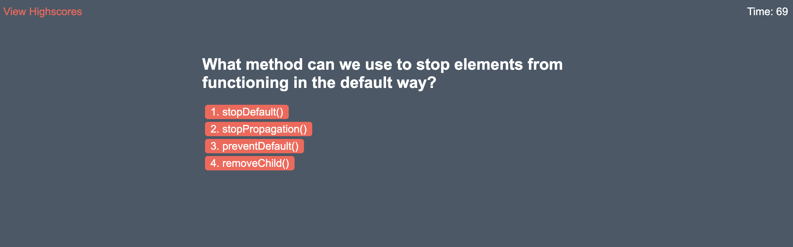
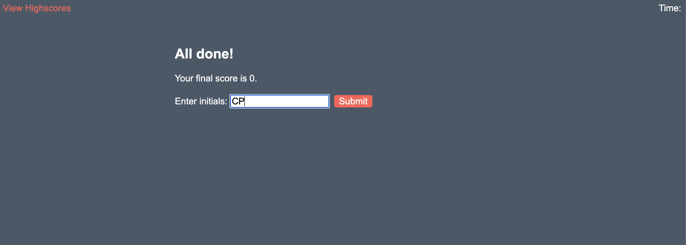
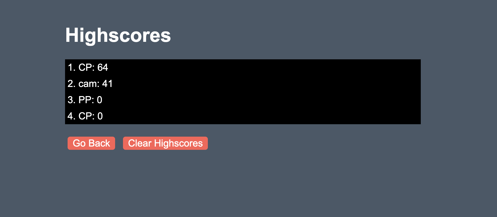

# Code Quiz

## Description 

Link to Code Quiz: https://cedekpoole.github.io/code-quiz/

### Technologies Used: 
- HTML
- CSS
- JavaScript

### Skills Practiced: 
- Functions => This project gave me the opportunity to practice and improve my use of JS functions, allowing me to write more clean, efficient code. Even though there is much for room for improvement, it was a great (rather humbling) experience trying to make this code work. 

- WebAPIs and DOM manipulation => WebAPIs (Web Application Programming Interfaces) are used as means to create complex functionality more easily (for more info, see here: https://developer.mozilla.org/en-US/docs/Learn/JavaScript/Client-side_web_APIs/Introduction). Within this challenge, a number of APIs were used. For example, the web storage API was utilised in order to permanently store client-side data (the highscores of each user) until the user presses the 'Clear Highscores' button. In addition to this, the DOM (the Document Object Model) is another API for HTML documents. Through the DOM - which represents the document as nodes and objects - you can change and manipulate the representation of the page without changing the original document (more info here: https://developer.mozilla.org/en-US/docs/Web/API/Document_Object_Model/Introduction). This project relies greatly on the manipulation of the DOM and it taught me how to add interactivity without the need to refresh the page. 

This 'code quiz' is a challenge that incorporates all the skills described above, and the key aim was to create a functional quiz that users could use to test their coding knowledge. It is a timed quiz where all the questions are JavaScript themed; it can score highscores so users can gauge their process against their peers. 

### Acceptance Criteria:

## Installation 

N/A

## Usage 

If you go to the [coding quiz web app](https://cedekpoole.github.io/code-quiz/), you are welcomed by a start screen. Once you press the 'start quiz' button,an audio file plays, the screen is hidden (via DOM manipulation), the first question appears and the timer starts (at 80 seconds). You can also view the highscores from the start screen, where a list of previous highscores (if any) are stored.

If you press an answer, you are given the next question. If you pick the correct answer, a 'correct' audio file is played and 'Correct Answer!' is given to you as feedback. If you pick the wrong answer, 15 seconds is deducted from your time and 'Wrong Answer!' is the feedback given. There are 8 questions overall.

Once you have completed the questions, you are shown the end screen. This is where you can insert your initials and save your final score - which is the number of seconds left at the end of the quiz - to local storage. 

Once you submit, you are sent to the 'highscores' HTML document. This is where the previous highscores are made visible. If you press 'Clear Highscores', you can clear localStorage and remove the previous entries. If you click the 'Go Back' button, you are taken back to the start screen where you can try again. 

## Roadmap 

My plan for the future is to refactor all the code and make it as clean and efficient as possible. In addition to this, I would like to restyle the document to make it more visually appealing. Any suggestions are welcome! 

## License 

N/A
